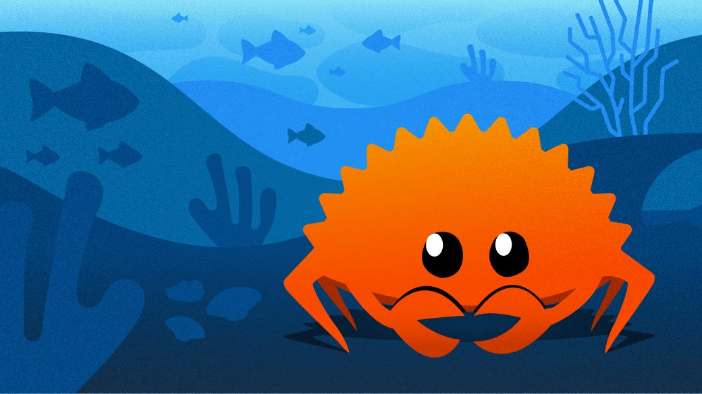

# The Crab Game Show




> The game for Rust > Aprendendo jogando com Rust de forma intuitiva e divertida

### Ajustes e melhorias

O projeto ainda está em desenvolvimento e as próximas atualizações serão voltadas para as seguintes tarefas:

- [x] Criar niveis para o jogo
- [x] A cada acerto o usuário passa de fase e ganha mais 5 lifes
- [x] O usuário começa com 10 points life para usar nas fases
- [x] Quando o usuário tiver 0 life points > precisa dar Game Over
- [ ] Cada nível existe uma dificuldade um pouco mais difícil


Novas features >

- [ ] 1. Dificuldade Crescente
   - [ ] Variedade de limites: Conforme o jogador avança de fase, aumente a faixa de números possíveis (ex.: fase 1 = 1 a 100, fase 2 = 1 a 200, fase 3 = 1 a 300).
   - [ ]  Dicas: Adicione dicas nas fases mais avançadas, como informar se o número secreto está em um intervalo específico (ex.: "Está entre 50 e 100").

- [ ] 2. Modos de Jogo Diferentes
  - [ ] Modo fácil, médio e difícil: No modo fácil, o jogador pode ter mais vidas e dicas mais detalhadas. No modo difícil, menos vidas e sem dicas.
  - [ ] Modo cronometrado: Adicione um cronômetro que limite o tempo total para adivinhar. Se o tempo acabar, o jogador perde automaticamente.

- [ ] 3. Histórico de Tentativas
    - [ ] Mostrar tentativas anteriores: Exiba os números já tentados pelo jogador para ajudar a tomar decisões melhores.
    - [ ] Análise de desempenho: No final de cada fase, mostre um resumo com o número de tentativas e pontos perdidos.

- [ ] 4. Vidas Extras ou Power-ups
   - [ ] Vidas extras: Dê ao jogador a possibilidade de ganhar vidas extras ao acertar o número secreto rapidamente (por exemplo, nas primeiras tentativas).
   - [ ] Power-ups: Implemente power-ups que podem ser coletados durante o jogo, como dicas adicionais, revelação de dígitos do número secreto, ou proteção que impede a perda de pontos em um erro.

- [ ] 5. Sistema de Conquistas e Pontuação
 - [ ] Conquistas: Adicione desafios, como "Adivinhar em menos de 5 tentativas" ou "Terminar 5 fases seguidas sem perder uma vida."
 - [ ] Pontuação acumulativa: Além de "life points", mantenha uma pontuação total que aumente conforme o jogador avança de fase e adivinhe corretamente com menos tentativas.

- [ ] 6. Variação de Fases
  - [ ] Fases especiais: Adicione fases bônus ou com mecânicas especiais, como fases onde os números secretos mudam a cada tentativa ou fases com dois números secretos    para adivinhar.
  - [ ] Níveis temáticos: Varie a ambientação das fases para criar uma sensação de progressão (ex.: florestas, desertos, cidades).

- [ ] 7. Desafios Diários
   - [ ] Desafio do dia: Crie um modo de jogo onde o jogador só pode jogar uma fase especial por dia, com regras ou mecânicas únicas, incentivando a volta ao jogo diariamente.

- [ ] 8. Personagens e Customização
- [ ] Avatares de jogador: Permita ao jogador escolher ou desbloquear avatares que representem o personagem nas fases.
- [ ] Personalização: Ofereça opções de customização, como skins ou temas para o visual do jogo conforme o jogador progride.

- [ ] 9. Multiplayer
- [ ] Modo de jogo contra outros jogadores: Adicione um modo competitivo onde dois jogadores tentam adivinhar o número secreto ao mesmo tempo, e quem acertar primeiro vence.
 - [ ] Desafios em equipe: Introduza um modo cooperativo, onde dois jogadores compartilham vidas e precisam trabalhar juntos para adivinhar os números.

 - [ ] 10. Estatísticas do Jogador
- [ ] Registro de desempenho: Mostre um painel de estatísticas com informações como tentativas totais, fases completadas, pontuação máxima, e acertos em primeira tentativa.


## 💻 Pré-requisitos

Antes de começar, verifique se você atendeu aos seguintes requisitos:

- Você instalou a versão mais recente de `https://rust-br.github.io/rust-book-pt-br/ch01-01-installation.html`

## 🚀 Instalando The Game Rust

Para instalar o The Game Rust, siga estas etapas:

Linux e macOS:

```
 `https://rust-br.github.io/rust-book-pt-br/ch01-01-installation.html`
```

Windows:

```
 `https://rust-br.github.io/rust-book-pt-br/ch01-01-installation.html`
```


Adicione comandos de execução e exemplos que você acha que os usuários acharão úteis. Forneça uma referência de opções para pontos de bônus!

## 📫 Contribuindo para The Game Rust

Para contribuir com The Game Rust, siga estas etapas:

1. Bifurque este repositório.
2. Crie um branch: `git checkout -b <nome_branch>`.
3. Faça suas alterações e confirme-as: `git commit -m '<mensagem_commit>'`
4. Envie para o branch original: `git push origin <nome_do_projeto> / <local>`
5. Crie a solicitação de pull.

Como alternativa, consulte a documentação do GitHub em [como criar uma solicitação pull](https://help.github.com/en/github/collaborating-with-issues-and-pull-requests/creating-a-pull-request).

<!-- ## 🤝 Colaboradores

Agradecemos às seguintes pessoas que contribuíram para este projeto: -->

<!-- <table>
  <tr>
    <td align="center">
      <a href="#" title="defina o título do link">
        <br>
        <sub>
          <b>Iuri Silva</b>
        </sub>
      </a>
    </td>
    <td align="center">
      <a href="#" title="defina o título do link">
        <br>
        <sub>
          <b>Mark Zuckerberg</b>
        </sub>
      </a>
    </td>
    <td align="center">
      <a href="#" title="defina o título do link">
        <br>
        <sub>
          <b>Steve Jobs</b>
        </sub>
      </a>
    </td>
  </tr>
</table> -->

## 😄 Seja um dos contribuidores

Quer fazer parte desse projeto? Clique [AQUI](https://github.com/rhenanteix/rust-study) e leia como contribuir.

## 📝 Licença

Esse projeto está sob licença. Veja o arquivo [LICENÇA](LICENSE.md) para mais detalhes.
